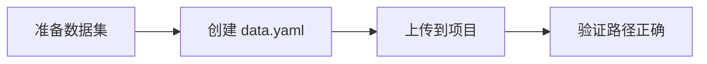
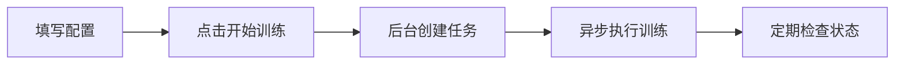
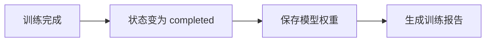

# 训练失败问题排查指南

## 🔍 问题诊断

如果你在网页上训练失败（显示 "failed" 状态），请按照以下步骤排查。

---

## ✅ 解决方案

### 问题 1: 数据集路径错误

**症状**: 训练立即失败，状态显示 "failed"

**原因**: 数据集配置文件路径不正确

**解决方法**:

#### 方法一：使用已创建的 COCO8 配置（推荐）

1. **运行诊断脚本**（已自动创建配置文件）:
```bash
python fix_training_issue.py
```

这会自动创建 `data/datasets/testdata/COCO8.yaml` 配置文件。

2. **在网页上使用正确的路径**:
   - 项目名称: `test` （或任意名称）
   - **数据集路径**: `data/datasets/testdata/COCO8.yaml` ✅
   - 模型类型: `YOLO11n`
   - 训练轮数: `100` （或其他值）

#### 方法二：创建自己的数据集配置

1. **准备 YOLO 格式数据集**:
```
your_dataset/
├── data.yaml          # 数据集配置
├── images/
│   ├── train/        # 训练图片
│   └── val/          # 验证图片
└── labels/
    ├── train/        # 训练标签 (.txt)
    └── val/          # 验证标签 (.txt)
```

2. **创建 data.yaml**:
```yaml
# 数据集根路径
path: /home/user/webapp/your_dataset

# 训练和验证集路径（相对于 path）
train: images/train
val: images/val

# 类别数量
nc: 3

# 类别名称
names:
  - class1
  - class2
  - class3
```

3. **上传数据集到项目**:
   - 将数据集放在 `data/datasets/your_dataset/`
   - 在网页上使用路径: `data/datasets/your_dataset/data.yaml`

---

### 问题 2: 数据集路径格式错误

**错误路径示例**:
```
❌ data/datasets/testdata/COCO8.yaml    (相对路径，可能无法找到)
❌ /data/datasets/testdata/COCO8.yaml   (绝对路径错误)
❌ datasets/testdata/COCO8.yaml         (不完整路径)
```

**正确路径示例**:
```
✅ data/datasets/testdata/COCO8.yaml    (从项目根目录的相对路径)
✅ /home/user/webapp/data/datasets/testdata/COCO8.yaml  (完整绝对路径)
```

---

### 问题 3: 训练阻塞 API

**症状**: 训练开始后，网页无响应

**原因**: 之前训练是同步的，会阻塞 API

**解决**: 已修复！现在训练在后台线程运行，不会阻塞 API。

---

## 📋 完整的训练配置示例

### 使用 COCO8 测试数据集

```
项目名称: test_coco8
数据集路径: data/datasets/testdata/COCO8.yaml
模型类型: YOLO11n
训练轮数: 10
批次大小: 16
图像尺寸: 640
```

### 使用自定义数据集

```
项目名称: my_custom_model
数据集路径: data/datasets/my_dataset/data.yaml
模型类型: YOLO11s
训练轮数: 50
批次大小: 16
图像尺寸: 640
```

---

## 🛠️ 诊断工具

### 运行诊断脚本

```bash
cd /home/user/webapp
python fix_training_issue.py
```

这个脚本会：
- ✅ 检查所有可能的数据集路径
- ✅ 自动创建 `data/datasets/testdata/COCO8.yaml`
- ✅ 验证 COCO8 数据集是否存在
- ✅ 测试模型加载
- ✅ 检查训练任务状态

### 手动检查数据集

```bash
# 检查 COCO8 数据集
ls -la datasets/coco8/

# 检查配置文件
cat data/datasets/testdata/COCO8.yaml

# 检查图片数量
find datasets/coco8/images -name "*.jpg" | wc -l
```

---

## 📝 训练流程

### 1. 准备阶段



### 2. 训练阶段



### 3. 完成阶段



---

## 🔄 重新训练步骤

如果训练失败，请按以下步骤重新尝试：

### 步骤 1: 运行诊断
```bash
python fix_training_issue.py
```

### 步骤 2: 验证配置文件
```bash
# 检查配置文件是否存在
ls -l data/datasets/testdata/COCO8.yaml

# 查看配置内容
cat data/datasets/testdata/COCO8.yaml
```

### 步骤 3: 在网页上重新配置

使用以下配置：
```
项目名称: test
数据集路径: data/datasets/testdata/COCO8.yaml  ← 重要！
模型类型: YOLO11n
训练轮数: 10  (用于快速测试)
```

### 步骤 4: 开始训练并监控

1. 点击"开始训练"
2. 查看训练任务列表
3. 等待状态从 "pending" → "running" → "completed"

### 步骤 5: 查看后台日志（Docker 环境）

```bash
# 查看容器日志
docker logs opencv-platform-dev --tail 100

# 实时查看日志
docker logs -f opencv-platform-dev
```

---

## 📊 训练状态说明

| 状态 | 说明 | 操作 |
|------|------|------|
| `pending` | 等待开始 | 正常，稍等片刻 |
| `running` | 训练中 | 正常，等待完成 |
| `completed` | 训练成功 | ✅ 查看模型和报告 |
| `failed` | 训练失败 | ❌ 查看错误信息，重新配置 |

---

## 🚨 常见错误及解决

### 错误 1: "数据集文件不存在"

**错误信息**:
```
FileNotFoundError: 数据集文件不存在: data/datasets/testdata/COCO8.yaml
```

**解决**:
```bash
# 运行诊断脚本自动创建
python fix_training_issue.py
```

### 错误 2: "训练集为空"

**错误信息**:
```
WARNING: Dataset 'coco8.yaml' images not found
```

**解决**:
```bash
# 检查数据集是否存在
ls -la datasets/coco8/images/train/

# 如果不存在，会自动下载
# 确保有网络连接
```

### 错误 3: "模型下载失败"

**错误信息**:
```
Failed to download yolo11n.pt
```

**解决**:
```bash
# 手动下载模型
cd /home/user/webapp
python -c "from ultralytics import YOLO; YOLO('yolo11n.pt')"
```

### 错误 4: "内存不足"

**错误信息**:
```
RuntimeError: CUDA out of memory
```

**解决**:
- 减小批次大小: 从 16 改为 8 或 4
- 减小图像尺寸: 从 640 改为 416
- 使用更小的模型: YOLO11n

---

## 📂 文件位置

### 配置文件
```
data/datasets/testdata/COCO8.yaml  ← 训练配置文件
```

### 数据集
```
datasets/coco8/
├── images/
│   ├── train/  (4 张图片)
│   └── val/    (4 张图片)
└── labels/
    ├── train/  (4 个标签)
    └── val/    (4 个标签)
```

### 训练输出
```
data/models/{项目名}/
└── train/
    ├── weights/
    │   ├── best.pt    ← 最佳模型
    │   └── last.pt    ← 最后模型
    ├── results.png    ← 训练曲线
    └── [其他报告]
```

---

## 💡 最佳实践

### 1. 首次训练建议

- ✅ 使用 COCO8 数据集测试
- ✅ 训练轮数设为 10 快速验证
- ✅ 使用 YOLO11n 模型（最快）
- ✅ 观察训练状态是否正常

### 2. 生产环境建议

- ✅ 准备充足的训练数据（至少 100 张/类）
- ✅ 训练轮数设为 50-100
- ✅ 根据需求选择合适的模型
- ✅ 使用 GPU 加速训练

### 3. 数据集要求

- ✅ 图片格式: JPG/PNG
- ✅ 标注格式: YOLO TXT
- ✅ 图片命名: 与标签文件一致
- ✅ 类别ID: 从 0 开始连续编号

---

## 🔗 相关文档

- [YOLO11 训练测试报告](YOLO11_TRAINING_TEST_REPORT.md)
- [快速入门指南](QUICK_START_TRAINING.md)
- [模型下载路径说明](MODEL_DOWNLOAD_PATHS.md)
- [项目 README](README.md)

---

## 📞 获取帮助

如果问题仍未解决：

1. 运行诊断脚本: `python fix_training_issue.py`
2. 查看 Docker 日志: `docker logs opencv-platform-dev`
3. 检查数据集配置: `cat data/datasets/testdata/COCO8.yaml`
4. 提交 GitHub Issue 并附上错误日志

---

**更新日期**: 2026-01-04  
**版本**: 1.0  
**状态**: 已修复训练失败问题 ✅
